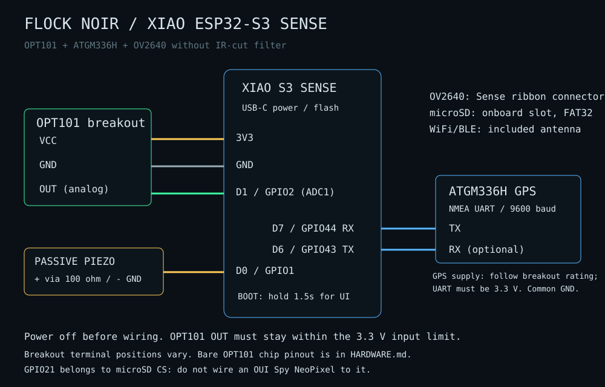

<div align="center">


# Hardware - Parts, Wiring & Assembly

*Bill of materials and build guide for the **Flock Noir**.*
See the main **[README](README.md)** for what the project is and its important
**experimental disclaimer** (this tool is a research aid, **not** a definitive detector -
always visually confirm an actual camera).

</div>

---

## Two things that trip everyone up

1. **The buzzer must be a *passive* piezo.** Active buzzers have a built-in oscillator and
   play only one fixed pitch - they **cannot** play the RTTTL tunes. Get a *passive* one.
2. **The IR-cut filter is the gatekeeper.** A stock camera lens blocks most 850 nm light, so
   IR detection range is short and finicky. An **IR-filter-removed lens** dramatically
   improves it (see [optional parts](#optional--recommended)).

---

## Bill of materials

### Complete XIAO ALPR reference build

| Part | Qty | Requirement / purpose |
|---|---:|---|
| **Seeed Studio XIAO ESP32-S3 Sense**, Sense expansion board and antenna | 1 | 8 MB flash, PSRAM, camera connector, onboard microSD slot; [Seeed hardware guide](https://wiki.seeedstudio.com/xiao_esp32s3_getting_started/). |
| **Compatible OV2640 camera without IR-cut filter** | 1 | Your existing OV2640 is the reference camera. Check the actual camera fitted to your board; do not assume every Sense shipment includes OV2640. |
| **3.3 V-compatible OPT101 analog breakout** | 1 | Required for the high-speed optical path. Integrated photodiode and amplifier; [TI specification](https://www.ti.com/product/OPT101). No separate BPW34 / op-amp needed. |
| **ATGM336H NMEA GPS module and antenna** | 1 | Keep the existing working setup: TX→D7, optional RX→D6, 9600 baud. Needed for geotagging and WiGLE logging. |
| **FAT32 microSD**, 4–32 GB | 1 | Required for persistent ALPR, radio and WiGLE logs; also stores recordings. |
| **Small passive piezo buzzer** | 1 | For distinct tones and Pig Detector siren. Active buzzers cannot play the melodies. |
| **~100 Ω series resistor** | 1 | Between D0 and the small passive piezo. A high-current speaker needs a driver; do not drive it directly. |
| **0.1 µF supply bypass capacitor** | 1 if absent on module | Close to OPT101 VCC/GND; a breakout may already include it. |
| Short hookup wires / solder, USB data cable, stable USB supply or power bank | As needed | Shared ground, reliable power and USB flashing. |

**Pig Detector minimum:** XIAO, antenna and passive buzzer; the Sense expansion,
camera and OPT101 are not detection inputs in that mode. Add SD for event logs.
**Wardrive:** XIAO, antenna, GPS and SD. The S3 surveys BLE, not Bluetooth Classic.
The full ALPR build uses every part above.

### Optional / recommended

A rigid enclosure that keeps the OPT101 and camera aimed together, optical shade
to prevent saturation, and a suitable near-IR filter can improve measurements.
OPT101 responds to visible light as well as near-IR; a filter does not identify
an ALPR. Battery options must match Seeed's documented voltage and polarity.
A separate, verified 10 Hz / 20 ms IR LED test source is useful for bench testing;
a TV remote only checks light sensitivity.

---

## Pin map

Everything below is fixed by the Sense board **except** the GPS, OPT101 and buzzer, which use free
header pins. None of these overlap, so the camera + SD keep working.

| Signal | GPIO | Header pad | Owner |
|--------|------|-----------|-------|
| Camera OV2640 (14 pins) | 10,11,12,13,14,15,16,17,18,38,39,40,47,48 | ribbon | Sense board (fixed) |
| microSD - CS | **21** | - | Sense board (`SD.begin(21)`) |
| microSD - SCK / MISO / MOSI | 7 / 8 / 9 | D8 / D9 / D10 | Sense board (default SPI) |
| PDM microphone (recording) | 42 (clk) / 41 (data) | - | Sense board (fixed) |
| **GPS RX** (<- module **TX**) | **44** | **D7** | `config.h` |
| **GPS TX** (-> module **RX**) | **43** | **D6** | `config.h` |
| **Buzzer signal** | **1** | **D0** | `config.h` |
| **OPT101 OUT** | **2** | **D1** | ADC1, works alongside WiFi |
| Free header pins | 3,4,5,6 | D2-D5 | Check boot-strapping before attaching loads |

---

## Wiring

### GPS (NMEA GNSS over UART)

```
GPS module            XIAO ESP32-S3 Sense
-----------           -------------------
  TX      ----------->  D7  (GPIO44)   [ESP RX]
  RX      -----------  D6  (GPIO43)   [ESP TX]
  VCC     ----------->  3V3
  GND     ----------->  GND
```
*If your module uses different pads, just change `GPS_RX_PIN` / `GPS_TX_PIN` / `GPS_BAUD` in
`config.h`.*

### Buzzer (passive piezo, 2-pin)

```
buzzer leg 1 (+)  ------->  D0  (GPIO1)     (optional ~100 ohm in series to soften volume)
buzzer leg 2 (-)  ------->  GND
```
*Passive piezos aren't polarized - if the legs are equal length, either orientation is fine.*
On power-up the board plays a **boot jingle**, which confirms the buzzer works.

---

## Assembly

1. **Attach the antenna** to the XIAO's IPEX connector and seat the camera ribbon.
2. **Format the microSD** as FAT32 and insert it into the Sense board's slot.
3. **Solder the GPS** (4 wires: TX->D7, RX->D6, 3V3, GND).
4. **Solder the buzzer** (signal->D0, other leg->GND).
5. Fit the IR-cut-free OV2640. Wire **OPT101 VCC→3V3, GND→GND, OUT→D1/GPIO2**. Use the labeled terminals, not an assumed terminal order.
6. **Flash** the firmware - prebuilt image or from source, see the
   [README install section](README.md#install-and-flash-xiao-esp32-s3-sense).
7. Power on, join **Flock Noir** / **flocknoir**, open `http://192.168.4.1`, select **ALPR**, then enable OPT101 after checking the wiring.

---

## First-light test (no camera target needed)

- **Buzzer:** hear the boot jingle? Passive buzzer wired correctly. In **Settings ->  Test**,
  a tune that *changes pitch* confirms it's passive.
- **SD:** the UI's microSD tile should read **ready**.
- **GPS:** take it outside; the **GPS Fix** tile flips to **FIX** once it sees satellites
  (cold start can take a few minutes).
- **IR pipeline:** point a **TV/AC remote** at the lens and press buttons - remotes pulse IR
  (at a different rate), a quick way to check light sensitivity. This does **not** validate ALPR timing or the detector. Use the bench checks below.

---

## OPT101 photodiode module (current reference build)



Disconnect USB and battery power before connecting wires. This build uses an
**OPT101 analog breakout** and an **OV2640 with its IR-cut filter removed**.
OPT101 already contains the photodiode and amplifier; no BPW34 or MCP6002 is
required. It responds to visible and near-IR light, not exclusively 850 nm.

| OPT101 breakout terminal | XIAO ESP32-S3 Sense |
|---|---|
| VCC / VS / V+ | **3V3** |
| GND | **GND** |
| OUT / VOUT / analog output | **D1 / GPIO2 (ADC1_CH1)** |

Terminal order varies by breakout. Confirm labels and its supply requirements;
this connection is for a breakout that operates from 3.3 V. A board marked for
5 V only needs its circuit checked before use. Do not put a 5 V output into the
XIAO ADC. Start with short wires; put supply decoupling at the sensor if the
breakout does not include it. TI recommends 0.01-0.1 uF supply bypassing.

### Bare OPT101 chip, standard single-supply circuit

These are **IC pin numbers viewed from above**, not breakout terminal positions.
Use the package's pin-1 marker and the [TI datasheet](https://www.ti.com/lit/ds/symlink/opt101.pdf).

| IC pin | Connection |
|---|---|
| 1, VS | 3V3 |
| 3, -V | GND |
| 8, Common | GND |
| 4, feedback | Join to pin 5 to use the internal 1 Mohm resistor |
| 5, output | D1 / GPIO2 |
| 2, negative input | Leave unconnected in this standard circuit |
| 6 and 7 | No connection |

### Bring-up

1. Power on and connect to **Flock Noir**, password **flocknoir**. Open `192.168.4.1`.
2. Select **ALPR**, then enable **IR photodiode sensor**. Watch the raw count and waveform
   as you cover/uncover the OPT101. The firmware cannot prove a sensor is
   connected simply by reading an ADC baseline.
3. Check for headroom in actual outdoor lighting. OPT101 is not rail-to-rail;
   its amplifier may saturate well below the ADC maximum. Lower incoming light
   or use an appropriate optical filter if the waveform flattens under bright light.
4. A TV remote is useful for checking response, but is not a valid ALPR test
   source. Verify a known 10 Hz, 20 ms light pulse and reject other frequencies.
5. In **ALPR mode**, verify ~1 kHz OPT101 sampling, camera analysis fps, WiFi/BLE
   readiness and drop/gap diagnostics while logging. Switch to **Pig Detector** or
   **Wardrive** and confirm optical sampling pauses; these modes are exclusive. See [detection and radio validation](docs/RADIO.md).

The supplied camera defaults now use lower fixed exposure/gain (150 / 2) for
an IR-cut-free OV2640. Tune those under real lighting. Point the camera and
OPT101 at the same area to make cross-sensor evidence more useful. A suitable
850 nm bandpass filter can reduce visible-light interference; verify the actual
filter transmission specification. No optics can establish camera identity.

### GPIO conflicts to avoid

The OUI Spy reference board is not the Sense peripheral layout. Keep the passive
buzzer on **D0/GPIO1**. **GPIO21 is microSD CS**, not an available NeoPixel pin.
GPS stays on **D7/GPIO44 RX** and **D6/GPIO43 TX**. For your ATGM336H, the
firmware uses the external UART profile at **9600 baud**. Keep its existing power
wiring if working; bare GNSS modules and breakouts can have different supply ratings.

---

## Raspberry Pi wiring (the `pi/` target)

The Raspberry Pi build uses the same sensors on the Pi's 40-pin header:

| Signal | Pi header pin | BCM |
|--------|---------------|-----|
| Buzzer (+) | 12 | GPIO18 (PWM) |
| Buzzer (-) | 6 | GND |
| GPS TX -> Pi | 10 | GPIO15 RXD |
| GPS RX <- Pi | 8 | GPIO14 TXD |
| MCP3008 CLK / DOUT / DIN / CS | 23 / 21 / 19 / 24 | GPIO11 / 9 / 10 / 8 (SPI0) |
| IR receiver front-end out | MCP3008 CH0 (CH1, CH2 for more) | - |

The Pi has no analog input, so the IR photodiode front ends above feed an **MCP3008**
ADC on SPI. The full pin-by-pin guide, header diagram, and placement notes are in
**[pi/README.md](pi/README.md#wiring)**.
