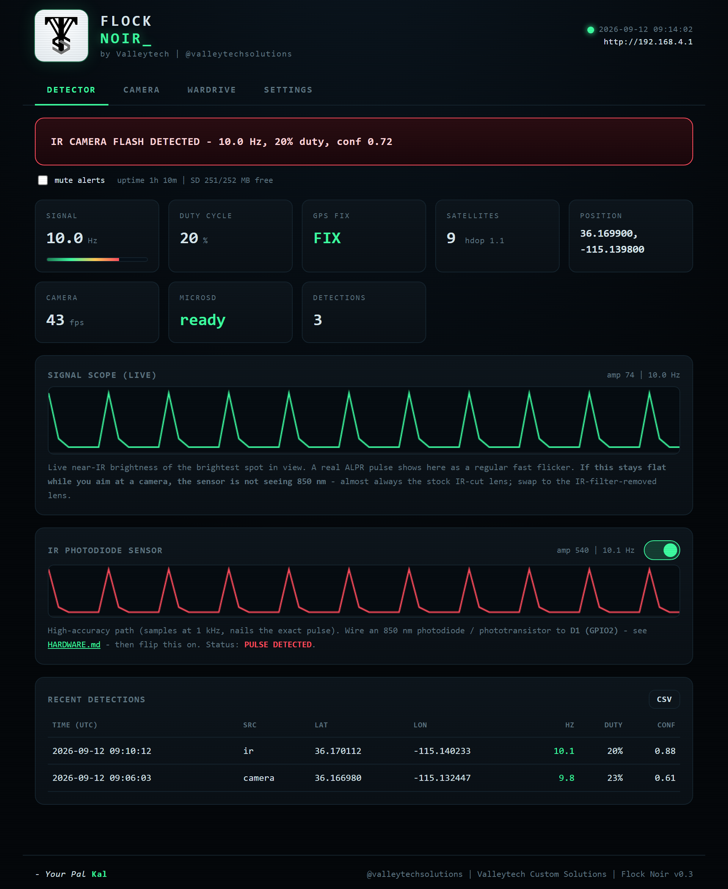
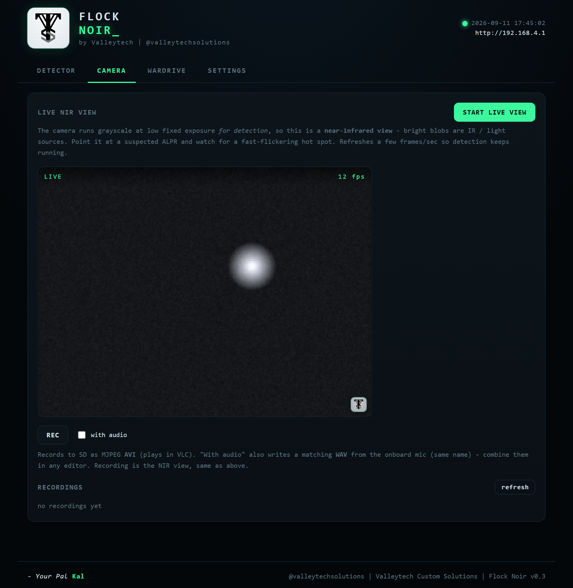
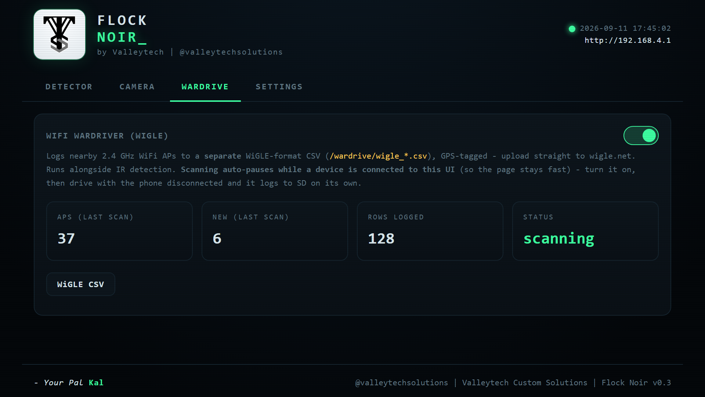
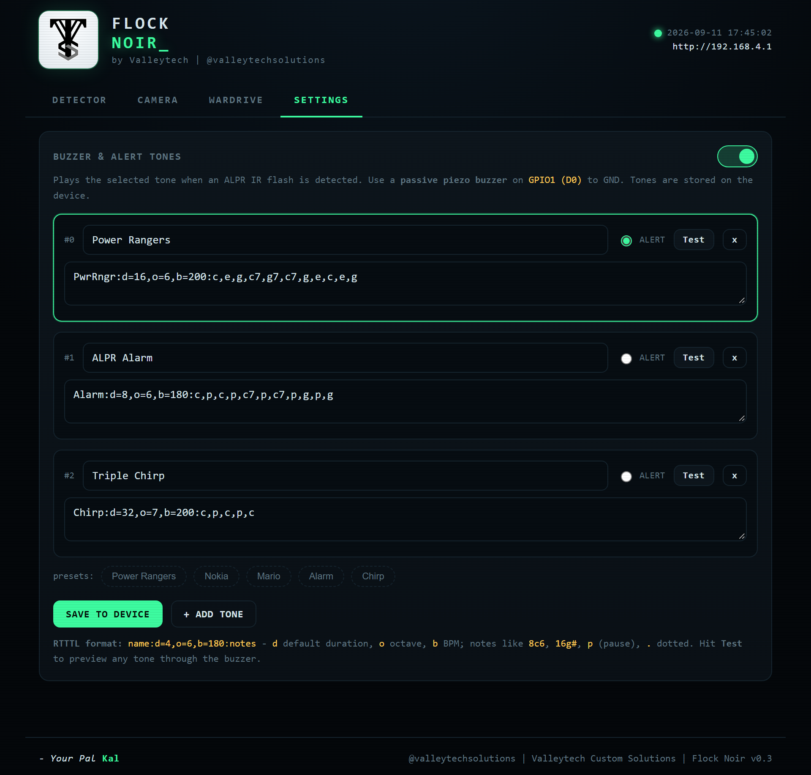
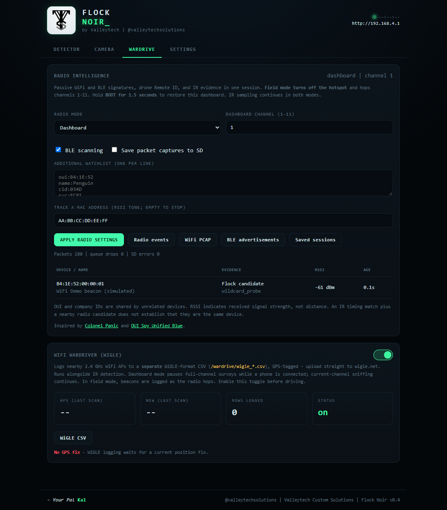

<div align="center">


# Flock Noir

**An experimental, open-source counter-surveillance tool for the Seeed XIAO ESP32-S3 Sense.**

It scans for the pulsed infrared (IR) illuminators used by many ALPR / Flock-style
surveillance cameras, tags what it finds with GPS, logs it to an SD card, and can
simultaneously act as a Wi-Fi wardriver, all served from a self-hosted web interface.

Valleytech Custom Solutions | @valleytechsolutions | by Your Pal Kal


</div>

---

> ## Read this first: experimental, not a definitive detector
>
> Flock Noir is an experimental proof of concept for research and education. It looks for
> an IR flash pattern (roughly 10 Hz, about 20 percent duty, 850 nm) that is consistent
> with the illuminators on some ALPR cameras. It does not, and cannot, positively identify
> any specific camera, brand, or product.
>
> **A positive alert is a hint, not proof.** Many things flash in the near-infrared: other
> security cameras, motion-sensor illuminators, some LED and traffic hardware, IR remotes,
> even sunlight off a modulated source. The onboard camera also samples far too slowly
> (about 30 to 50 fps) to prove a 20 ms pulse.
>
> **You must visually confirm an actual camera before drawing any conclusion.** Do not treat
> this device as authoritative, do not act on its output alone, and do not present its
> alerts as fact. It is provided as is, with no warranty. You are responsible for using it
> lawfully. See [Legal and ethics](#legal-and-ethics).
>
> Not affiliated with, endorsed by, or associated with Flock Safety or any camera
> manufacturer. "Flock" is used generically to describe a category of ALPR camera.

---

## Radio + OPT101 integration (0.4)

Flock Noir now adds passive WiFi Flock/ALPR candidate detection, BLE vendor and
watchlist scanning, target RSSI tones, WiFi packet capture, BLE advertisement
capture, and drone Remote ID. OPT101 pulse timing runs alongside wardriving;
events record their source and supporting evidence. The original UI design and
four tabs remain. See [features, limits and operation](docs/RADIO.md).

Thanks to **[Colonel Panic](https://colonelpanic.tech/)** and
**[OUI Spy Unified Blue](https://github.com/colonelpanichacks/oui-spy-unified-blue)**
for the research and feature inspiration. Please support his work. Full
[attributions and source provenance](ATTRIBUTIONS.md).

## Screenshots

| Detector: live IR alert, GPS tag, CSV | Camera: near-IR live view and recording |
| :---: | :---: |
|  |  |
| **Wardrive: WiGLE Wi-Fi logging** | **Settings: buzzer and RTTTL tones** |
|  |  |

---



Radio panel preview uses simulated data; it is not a field detection result.

## What it does

| Capability | Description |
|---|---|
| OPT101 pulse timing | Dedicated ADC task; width, duty, consecutive intervals, regularity, clipping and sampling-gap checks. |
| Radio intelligence | Passive WiFi candidates, BLE watchlists, RSSI tracking, Remote ID, SD captures and evidence logs. |
| IR camera-flash detection | Watches the camera's near-IR view for a compact source pulsing at the target signature and raises an alert. |
| GPS logging | Tags each detection with position and time (NMEA GNSS over UART) and appends a row to a CSV on the SD card. |
| Wi-Fi wardriver | Optionally scans 2.4 GHz Wi-Fi and logs every access point to a separate WiGLE-format CSV, ready to upload to [wigle.net](https://wigle.net). |
| Audible alerts | Drives a passive piezo buzzer with configurable RTTTL ringtones (a boot jingle plus a distinct alert tone). |
| Live view and recording | Stream the camera in the browser and record to SD as MJPEG AVI, optionally with a WAV from the onboard microphone. |
| Self-hosted web UI | A dark, phone-friendly control panel served over the device's own Wi-Fi access point and captive portal. No internet required. |

Everything runs on a single low-cost board with no cloud, no account, and no internet
connection. It is built to be read, audited, and modified: the detector, the buzzer, the
wardriver, and the recorder are each a small, self-contained module.

---

## How the IR detection works, and its limits

**The signal.** Many ALPR cameras use an 850 nm IR illuminator that is amplitude modulated,
roughly a 10 Hz square wave, about 20 ms on and 80 ms off (near 20 percent duty). That
temporal signature, plus the near-IR band, is what Flock Noir keys on.

**The method.** The OV2640 is a good spatial sensor but a poor temporal one for a 10 Hz
pulse, so the firmware works in the time domain:

1. The camera runs grayscale at a small frame size to maximize frame rate, with
   auto-exposure, gain, and white balance forced off so the pulsing is not corrected away.
   This is the single most important setting.
2. Each frame yields one brightness sample (the brightest pixel), a saturated-blob size,
   and a centroid, each timestamped in microseconds.
3. Over a sliding window the detector finds rising edges, measures the interval between
   them (target near 100 ms) and the duty cycle (target near 20 percent), and requires the
   bright source to be spatially compact, which rejects whole-frame flicker from mains
   lighting. It combines these into a confidence score from 0 to 1.

**The limits, and why visual confirmation is mandatory:**

- At about 40 fps you get only around 4 frames per 100 ms cycle, so a 20 ms pulse lands in
  roughly one frame. The firmware can reliably flag a 10 Hz periodicity and an approximate
  duty, but it cannot reconstruct the exact 20/80 waveform from the camera alone.
- The IR-cut filter in a stock lens heavily attenuates 850 nm. Detection is far more
  reliable with an IR-filter-removed lens (see [HARDWARE.md](HARDWARE.md)).
- Other IR emitters can produce a similar pattern. This tool narrows down where to look;
  your eyes make the call.

The most robust way to confirm the exact timing is a dedicated OPT101 analog module on an ADC
pin sampled at ~1 kHz. **This is now built in** as a second pulse-timing detector
(`irsensor.cpp`) that runs alongside the camera - enable it on the Detector tab once the
sensor is wired. It builds on research from [Noflock/Flock-IR-Detection](https://github.com/Noflock/Flock-IR-Detection). For the full background on how ALPR IR works and how both detectors operate, see
**[DETECTION.md](DETECTION.md)**; for the circuit, see [HARDWARE.md](HARDWARE.md).

---

## Hardware targets

Flock Noir runs on two boards. They share one web UI (`web/index.html`), one API, and
the same log formats, so features stay in lockstep.

| Target | Camera | Notes |
|---|---|---|
| **Seeed XIAO ESP32-S3 Sense** (`firmware/FlockNoir/`) | OV2640; the stock lens has an IR-cut filter | Tiny and cheap; Arduino C++. Prebuilt image in `binaries/`. Setup below. |
| **Raspberry Pi** with Wi-Fi + CSI camera (`pi/`) | Camera Module **NoIR** v2/v3: no IR-cut filter, up to 90 fps | Python; runs as a systemd service with a field hotspot. Reference build: Pi Zero 2 W. A **ready-to-flash image** is on the [Releases](https://github.com/valleytechsolutions/Flock-Noir/releases) page. See **[pi/README.md](pi/README.md)**. |

The rest of this page describes the XIAO build; the Pi has its own guide.

## Hardware

A complete, linked bill of materials, wiring diagram, and assembly guide is in
[HARDWARE.md](HARDWARE.md), and low-cost add-ons that make it better (a de-filtered lens,
an IR photodiode, battery, OLED) are in [UPGRADES.md](UPGRADES.md). In short you need:

- Seeed Studio XIAO ESP32-S3 Sense (has the OV2640 camera and microSD slot on board)
- A microSD card (FAT32)
- A GNSS/GPS module (NMEA over UART)
- A passive piezo buzzer (passive only; active buzzers cannot play the tunes)
- The included antenna, some wire, and optionally a LiPo battery

Verified pin map (nothing overlaps the Sense camera or SD):

| Signal | GPIO | Header |
|---|---|---|
| Camera (OV2640) | 10,11,12,13,14,15,16,17,18,38,39,40,47,48 | ribbon |
| microSD (SPI) | CS 21, SCK 7, MISO 8, MOSI 9 | D8/D9/D10 |
| GPS RX (from module TX) | 44 | D7 |
| GPS TX (to module RX) | 43 | D6 |
| Buzzer signal | 1 | D0 |
| OPT101 analog OUT | 2 | D1 / ADC1 |

---

## Install and flash (XIAO ESP32-S3 Sense)

The reference build is **XIAO ESP32-S3 Sense, 8 MB flash, OPI PSRAM**, with
ATGM336H GPS at 9600 baud, OPT101 on D1 and an OV2640 without its IR-cut filter.
See [HARDWARE.md](HARDWARE.md) before wiring. The radio build uses the pinned
Arduino core/NimBLE combination in [platformio.ini](platformio.ini); use that
configuration rather than an arbitrary Arduino board-package version.

### Build and upload with PlatformIO

Install Python and PlatformIO, then from the repository root:

```bash
python -m pip install platformio==6.1.19
python tools/html2header.py
python -m platformio run -e xiao_esp32s3_sense
python -m platformio run -e xiao_esp32s3_sense -t upload --upload-port COM44
python -m platformio device monitor --port COM44 --baud 115200
```

Replace `COM44` with your actual port (`/dev/ttyACM0` on many Linux systems).
TinyGPSPlus 1.0.3 is the existing GPS parser; its pinned version and the external
GPS profile preserve ATGM336H wiring and 9600 baud. The remaining radio, camera,
SD and web APIs ship with the pinned ESP32 core. A 6 MB application partition
leaves room for the combined build; this partition layout has no OTA slot.

### Flash the merged image

The current full image and SHA-256 checksum are in [binaries/](binaries/).
Build output also includes `.pio/build/xiao_esp32s3_sense/firmware.factory.bin`.

```bash
python -m pip install esptool
python -m esptool --chip esp32s3 --port COM44 --baud 460800 write-flash 0x0 binaries/FlockNoir-merged-0x0.bin
```

Use a USB-C **data** cable. If the board will not enter the bootloader, hold BOOT,
press and release RESET, release BOOT, and try again. If transfers fail, use
115200 baud. No full-chip erase is normally necessary. Flashing a factory image
changes the application/partition layout; back up any older flash filesystem
contents you need. The microSD card is separate and is not formatted by flashing.

For browser flashing, open [Espressif's esptool-js](https://espressif.github.io/esptool-js/)
using desktop Chrome or Edge, connect the board, select the merged binary at
**0x0**, and program. Do not flash the application-only `firmware.bin` at 0x0.
Do not install Unified Blue's binary onto this build expecting Sense pin mappings.

After reboot: join **Flock Noir**, password **flocknoir**, and open `192.168.4.1`.
Confirm GPS bytes arrive, SD mounts and the OPT101 responds to light. Enable its
Detector toggle, enable WiGLE in Wardrive, and apply Field mode for passive
channel hopping. **Hold BOOT for 1.5 seconds** to restore the dashboard.

Firmware builds and host regression tests run in GitHub Actions. A compile and
synthetic tests do not establish field accuracy; follow the hardware test
checklist in [docs/RADIO.md](docs/RADIO.md#validation-before-relying-on-a-build).

---

## Using it

1. Power the board. It plays a boot jingle (the Super Mario theme by default).
2. Join the Wi-Fi network it creates (SSID and password are set in `config.h`).
3. A captive portal page opens automatically, like hotel Wi-Fi. If it does not, browse to
   http://192.168.4.1. iPhones rely on the built-in captive portal; if Safari still balks,
   briefly disable cellular data.

The interface has four tabs:

- Detector: live alert banner, signal, duty, GPS, fps, and SD tiles, recent detections,
  and a CSV download.
- Camera: live near-IR view, plus a record button for MJPEG AVI (optionally with a WAV
  from the microphone).
- Wardrive: radio modes, BLE scanning, watchlists, target tracking, capture downloads,
  saved radio sessions and the independent WiGLE toggle. Hold BOOT to return from Field mode.
- Settings: enable or disable the buzzer and edit the RTTTL tone library, with presets and
  a Test button. Settings are saved on the device.

---

## Logs and data

IR, radio and WiGLE data are kept in separate files on the SD card:

| Log | Path | Format |
|---|---|---|
| IR detections | /logs/flock_*.csv | iso_utc, uptime_ms, source, lat, lon, alt_m, sats, hdop, freq_hz, duty, confidence, blob_x, blob_y, blob_frac, level_pp, evidence, logged_uptime_ms |
| Wi-Fi wardrive | /wardrive/wigle_*.csv | WiGLE 1.4 (MAC, SSID, AuthMode, FirstSeen, Channel, RSSI, Lat, Lon, Alt, Accuracy, Type) |
| Radio events and captures | /radio/events_*.jsonl, wifi_*.pcap, ble_*.jsonl | [Schemas, limits and downloads](docs/RADIO.md#data-and-resource-limits) |
| Recordings | /videos/rec_*.avi (and .wav) | MJPEG AVI (and PCM WAV) |

---

## Configuration and tuning

Everything lives in [firmware/FlockNoir/config.h](firmware/FlockNoir/config.h): Wi-Fi SSID
and password, GPS pins and baud, buzzer pin, and the detection thresholds. Common tweaks:

| Symptom | Try |
|---|---|
| Nothing detects, or the view is too bright | Lower CAM_AEC_VALUE; keep CAM_AGC_GAIN at 0 |
| Blob never saturates | Lower SAT_THRESHOLD, or use an IR-filter-removed lens |
| Too many false positives | Raise DETECT_CONFIDENCE and MIN_GOOD_CYCLES; tighten PERIOD_TOL_MS, DUTY_MIN, DUTY_MAX |
| Misses real cameras | Loosen PERIOD_TOL_MS; widen DUTY_MIN and DUTY_MAX; lower MIN_AMPLITUDE |
| Using the Seeed L76K GPS | Set GPS_BAUD to 9600 (the LC29H uses 115200) |

Watch the USB serial console at 115200 baud for boot info and every alert with coordinates.
A TV remote (IR, at a different rate) is a handy way to confirm the pipeline is alive.

---

## Repository layout

```
.
|-- README.md                    this file
|-- HARDWARE.md                  parts list (with Seeed links), wiring, assembly
|-- DETECTION.md                 how ALPR IR works and how both detectors operate
|-- UPGRADES.md                  low-cost add-ons
|-- CHANGELOG.md
|-- LICENSE                      MIT (plus an experimental-software notice)
|-- binaries/
|   \-- FlockNoir-merged-0x0.bin prebuilt image, flash at 0x0
|-- docs/                        logo and screenshots
|-- web/
|   |-- index.html               the shared web UI (single source of truth for both targets)
|   \-- logo.png
|-- tools/
|   \-- html2header.py           web/index.html -> firmware/FlockNoir/web_ui.h
|-- firmware/
|   \-- FlockNoir/               the XIAO ESP32-S3 Arduino sketch
|       |-- FlockNoir.ino        main loop: camera, detector, GPS, CSV, buzzer, wardriver, recorder, web
|       |-- config.h             all pins and tunables
|       |-- detector.h/.cpp      time-domain IR pattern detector
|       |-- buzzer.h/.cpp        non-blocking RTTTL player and NVS tone library
|       |-- wardriver.h/.cpp     async Wi-Fi scan to WiGLE CSV
|       |-- recorder.h/.cpp      MJPEG-AVI writer with optional WAV
|       |-- irsensor.h/.cpp      OPT101 pulse detector (target 1 kHz ADC task)
|       |-- web_ui.h             the web UI embedded in flash (generated from web/index.html)
|       |-- logo.h               embedded logo (generated)
|       |-- assets/logo.png      source logo
|       \-- tools/logo2header.py logo to logo.h converter
\-- pi/                          the Raspberry Pi target (Python)
    |-- README.md                install, wiring, and usage for the Pi
    |-- install.sh               one-shot installer: deps, data dir, systemd service
    |-- netmode.sh               field hotspot / home Wi-Fi mode switch
    |-- flocknoir.service        systemd unit
    |-- config.py                all settings
    \-- flocknoir/               camera, detector, buzzer, gps, wardriver, recorder,
                                 irsensor, logger, web, main
```

---

## Roadmap

- [x] Camera IR pattern detector, GPS tag, CSV, and web alert UI
- [x] Branded UI, passive-buzzer RTTTL alerts, and settings
- [x] Wi-Fi wardriver (WiGLE CSV, separate log)
- [x] Live near-IR view and MJPEG-AVI / WAV recording
- [x] OPT101 pulse validation and temporal IR/radio evidence correlation (XIAO)
- [ ] Rolling-shutter band analysis to recover the 20/80 shape from single frames
- [ ] On-device map, GPX, and KML export
- [ ] Bluetooth / BLE OUI detection

---

## Credits and attributions

Flock Noir builds on the work of the counter-surveillance and wardriving community.
Thanks to:

- **Colonel Panic, OUI Spy** ([github.com/colonelpanichacks/oui-spy](https://github.com/colonelpanichacks/oui-spy),
  [colonelpanic.tech](https://colonelpanic.tech/), [Tindie](https://www.tindie.com/products/colonel_panic/oui-spy/)).
  OUI Spy pioneered approachable ESP32 hardware for passively detecting surveillance
  devices, and was a primary inspiration for the signature-detection approach here.
- **Noflock / Flock-IR-Detection** ([github.com/Noflock/Flock-IR-Detection](https://github.com/Noflock/Flock-IR-Detection)).
  The photodiode circuit and the edge/period IR-detection algorithm in Flock Noir follow this
  project's photodiode pulse-detection research; Flock Noir still requires field validation.
- **justcallmekoko, ESP32 Marauder** ([github.com/justcallmekoko/ESP32Marauder](https://github.com/justcallmekoko/ESP32Marauder)).
  The reference open-source ESP32 wireless research toolkit; its approachable, hackable
  design for wardriving and radio recon shaped how Flock Noir's wireless side is built.
- **Midwest Gadgets (@hamspiced), Piglet wardriver** ([github.com/hamspiced/piglet](https://github.com/hamspiced/piglet),
  [midwestgadgets.org](https://www.midwestgadgets.org/product-page/piglet)). The Wi-Fi
  wardriving side of this project, WiGLE-format logging on the XIAO with a web UI, is
  modeled on Piglet's clean, transparent design.
- **[Seeed Studio](https://www.seeedstudio.com/)** for the XIAO ESP32-S3 Sense platform and
  its [documentation](https://wiki.seeedstudio.com/xiao_esp32s3_getting_started/).
- **[Espressif](https://github.com/espressif/arduino-esp32)** (Arduino-ESP32 core,
  esp32-camera) and Mikal Hart ([TinyGPSPlus](https://github.com/mikalhart/TinyGPSPlus)).
- **[WiGLE](https://wigle.net)** for the wardriving CSV format and mapping ecosystem.

If you build on this, please keep these attributions and add your own.

---

## License

Released under the [MIT License](LICENSE): free to use, modify, and distribute, with
attribution. See the license file for the full text and the experimental-software notice.

---

## Legal and ethics

- This tool is for lawful security research, education, and personal privacy awareness.
- Wardriving: logging the existence of broadcast Wi-Fi beacons is legal in many places, but
  you are responsible for the laws in your jurisdiction. Do not connect to, probe, or
  interfere with networks you do not own. Never log or transmit personal data.
- Recording: audio and video recording laws vary widely (one-party versus all-party
  consent, public versus private spaces). Know and follow your local rules before recording.
- The IR detector is a research aid, not evidence. Do not use its output to harass, target,
  or make claims about any person, property, or organization.
- Provided as is, without warranty. You assume all risk and responsibility.

---

<div align="center">

Made by Valleytech Custom Solutions | @valleytechsolutions | Your Pal Kal

</div>

See [ATTRIBUTIONS.md](ATTRIBUTIONS.md) for the full OUI Spy / Unified Blue credits, support links and research provenance.
