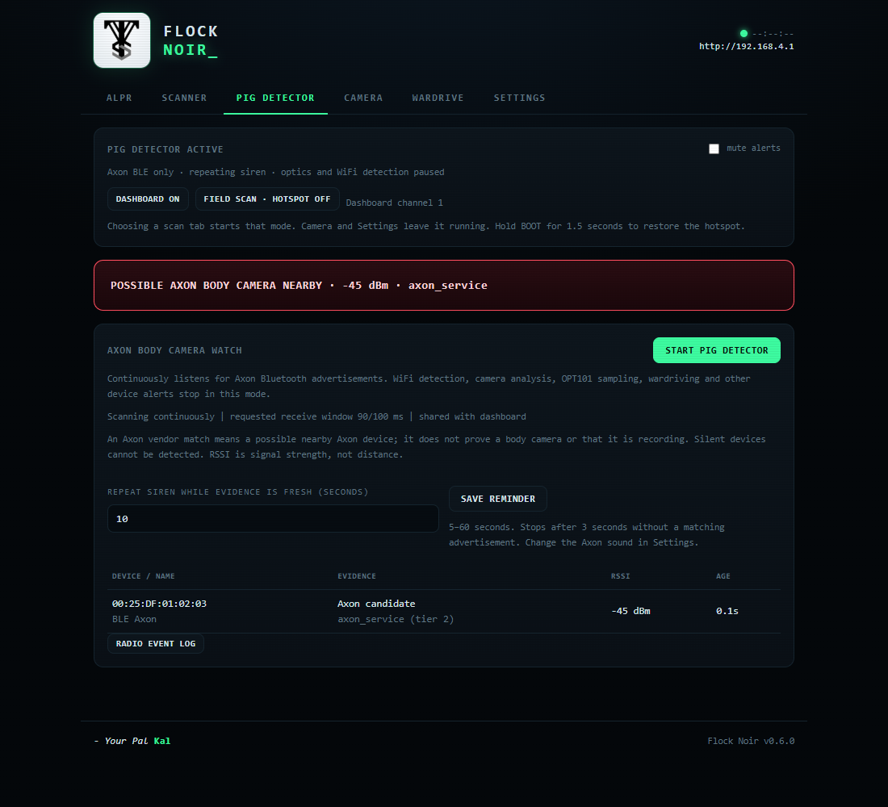

<div align="center">


# Flock Noir

**ALPR evidence, Axon alerts and wardriving on the Seeed XIAO ESP32-S3 Sense.**

By Your Pal Kal · Arduino / PlatformIO · [MIT](LICENSE) · Experimental
</div>

**[INSTALL WITH THE XIAO WEB FLASHER](https://valleytechsolutions.github.io/Flock-Noir/)** · [0.6.0 release](https://github.com/valleytechsolutions/Flock-Noir/releases/tag/xiao-v0.6.0) · [Parts and wiring](HARDWARE.md) · [Detection details](docs/RADIO.md)

Flock Noir combines OPT101 pulse measurements, an IR-cut-free OV2640 and passive
Flock-You WiFi/OUI/BLE rules. It records **possible ALPR evidence**, including how
each event was detected. The dark green dashboard, VGA preview and editable
per-device sounds remain. No cloud account is needed.

**There is no verified universal ALPR flash rate in this project.** The optical
reference profile is **8–12 Hz, 10–30% duty, 8–35 ms pulses**. A matching light or
vendor OUI cannot prove a camera's identity. The sensors measure light intensity,
not wavelength. Nearby optical and radio sources may be different devices; a
quiet scan does not establish that cameras are absent. See [timing and validation](DETECTION.md).

## Four exclusive scan modes — XIAO 0.6.0

Choosing one of these tabs **starts that mode and stops the previous scanner**.
The active mode and resources appear above every tab. Camera and Settings are
views; opening them leaves the selected scan mode running.

| Scan tab | What runs | Alerts and logs |
|---|---|---|
| **ALPR** | OPT101 at ~1 kHz, camera brightness analysis, ALPR/Flock BLE and promiscuous WiFi/OUI/probe rules | Retro alerts; dedicated `/alpr/alpr_*.csv` with individual or combined detection methods |
| **SCANNER** | General WiFi/BLE device signatures, watchlist, RSSI tracking, Remote ID; optics paused | Editable sounds for ALPR, Axon, Ring, Meta, Flipper, Pineapple, Biscuit and drones; radio JSONL; ALPR radio matches also enter ALPR CSV |
| **PIG DETECTOR** | Axon BLE only; WiFi detection, camera analysis, OPT101, wardrive and recording paused | Axon siren immediately on fresh evidence, then every 10 seconds while matches continue; 5–60 second reminder setting; radio JSONL |
| **WARDRIVE** | WiFi network surveys and BLE advertisements; optical analysis and detection rules paused | No automatic detection tones; separate WiGLE CSV containing `WIFI` and `BLE` rows |

Pig Detector listens continuously for Axon company/service identifiers, advertised
Axon names and public-address Axon OUI hints. Vendor evidence means a **possible
Axon device**, not a guaranteed body camera or recording state. Its requested BLE
receive window is 90 ms per 100 ms with the dashboard, and 100 ms per 100 ms in
field coverage with WiFi off. Actual reception also depends on interference and
advertising behavior. Reminder sounds stop after 3 seconds without a matching
advertisement. Muting still permits logging; **Settings → Axon** changes its tone.

General Scanner retains Colonel Panic's Flock-You approach, including the full
34-prefix union, transmitter/receiver roles, wildcard-probe and strict IE evidence.
Weak shared-vendor hints stay distinct from stronger signatures. Biscuit uses its
name and optional service; the shared Arduino example UUID alone is insufficient.
Pineapple Pager is covered only as a Pineapple-family network-name candidate, with
no unique Pager model fingerprint. ESP32-S3 supports **2.4 GHz WiFi and BLE**;
it cannot survey Bluetooth Classic, 5/6 GHz WiFi or silent radios.



*UI preview uses simulated evidence, not a field detection.*

## Install and flash (XIAO ESP32-S3 Sense)

1. Open the **[web flasher](https://valleytechsolutions.github.io/Flock-Noir/)** in
   desktop Chrome or Edge. Connect the XIAO with a USB **data** cable and close
   serial monitors using its port.
2. Select **Connect & Install**, choose the XIAO serial port and follow the prompts.
   Leave **Erase device unchecked** when updating to keep saved settings.
   The installer uses split images that leave the NVS settings area intact.
3. If USB discovery fails, hold **BOOT**, tap **RESET**, then release BOOT and
   reconnect. Tap RESET after installation if it remains in the bootloader.
4. Join WiFi **Flock Noir**, password **flocknoir**, and open **http://192.168.4.1**.
   Your phone may report that the hotspot has no internet; stay connected.
5. Select **ALPR**, **Scanner**, **Pig Detector** or **Wardrive**. Saved mode and
   tone settings persist. On upgrades, the previous ALPR/General selection migrates.

This binary is for the **Seeed XIAO ESP32-S3 Sense with OV2640**. A chip-family check
cannot distinguish every S3 board. **ESP32-CAM has no supported build here** and
uses different pins. Raspberry Pi Zero 2 W remains on its separate **0.5.1** release
and [Pi guide](pi/README.md); this update targets XIAO only.

### Radio coverage

Coverage is separate from the scan mode. **DASHBOARD ON** keeps the hotspot available;
WiFi detection listens on its channel while a client is connected. Wardrive can
run passive full-channel surveys when no dashboard clients are connected.

**FIELD SCAN · HOTSPOT OFF** gives the radio broader coverage: ALPR uses channels
1/6/11 with 350 ms dwell; Wardrive uses channels 1–11; General uses the selected
channel plan. BLE continues alongside WiFi. Pig Detector instead switches WiFi
off and reserves its scan window for Axon BLE. **Hold BOOT for 1.5 seconds** to
restore the dashboard without changing the chosen scanner. Boot always restores
the hotspot, even if the saved scan mode is Pig Detector or Wardrive.

## Parts and wiring

Use the [full bill of materials and assembly guide](HARDWARE.md). For the complete
ALPR build: XIAO S3 **Sense**, compatible **OV2640 without its IR-cut filter**,
**3.3 V OPT101 analog module**, ATGM336H GPS, antenna, FAT32 microSD, a passive piezo,
wires and a USB data cable/power source. No additional bare photodiode or op-amp
is needed when using OPT101.


| Connection | XIAO header / GPIO |
|---|---|
| OPT101 VCC, GND, OUT | **3V3**, **GND**, **D1 / GPIO2** |
| ATGM336H TX → ESP RX | **D7 / GPIO44**, **9600 baud** |
| ATGM336H RX ← ESP TX (optional) | **D6 / GPIO43** |
| Passive piezo signal / return | **D0 / GPIO1** / **GND**; ~100 Ω series resistor |
| Sense camera and microSD | Existing ribbon/board connections; SD CS **GPIO21** |

**D1 is the second left pin** with USB at the top and the component side facing
you. Disconnect power before wiring. Follow the breakout labels; terminal order
varies. Use a 3.3 V-compatible module and never feed 5 V into the ADC. Keep your
working ATGM336H power wiring; its UART pins and 9600 baud remain unchanged.

Select **ALPR**, enable **IR photodiode sensor** after connecting OPT101, and cover /
uncover it to check the raw count and waveform. First-install sensor default is
off; updating preserves your saved enable setting. ADC activity alone does not
prove the module is connected. Keep camera and OPT101 aimed at the same area.

## ALPR evidence and CSV

The ALPR tab shows four evidence indicators and their ages. The 3-second
correlation window supports both radio-first and optical-first encounters, with
strong evidence expiring independently of newer weak hints.

- **OPT101:** ~1 kHz ADC, adaptive noise threshold, pulse width/duty, at least four
  consecutive valid intervals, regularity, clipping and sampling-gap checks.
- **Camera:** 640×480 JPEG with fixed exposure/gain, two PSRAM buffers and a separate
  80×60 brightness analysis task. Around 25 fps cannot measure a 20 ms pulse exactly.
  A 10 Hz / 20 ms test light can appear as 5 Hz; such events retain the **observed**
  frequency and `camera_timing=aliased_candidate`, with reduced confidence.
- **Radio:** Flock-You OUI/probe evidence and BLE names/services. OUI-only matches
  remain candidates. Source proximity strengthens evidence but does not bind a
  light source to a specific MAC.

**[ALPR CSV on your device](http://192.168.4.1/api/alpr.csv)** is also available
through the ALPR tab. Its 31 columns include observation/log timestamps, GPS,
`source`, measured `freq_hz` and `duty`, `detection_method` (`ir`, `camera`, `ble`,
`wifi`, or combinations), category, assessment, MAC/RSSI, radio rule/tier,
`ir_timing_match`, `camera_pattern`, `ir_pulse_ms`, `ir_sample_hz`,
`camera_sample_hz`, `camera_timing` and `scan_mode`. Unmeasured radio-only pulse
fields remain empty. Axon/Meta/etc. never enter this ALPR file. Optical events
still log without GPS, with unavailable coordinates and a boot-relative timestamp.

| Data | SD location | Download |
|---|---|---|
| ALPR / optical candidates | `/alpr/alpr_*.csv` | ALPR CSV; `/api/log` remains an alias |
| WiGLE surveys | `/wardrive/wigle_*.csv` | Wardrive → WiGLE CSV |
| Radio detection events | `/radio/events_*.jsonl` | Scanner/Pig Detector → radio event log |
| Optional General captures | `/radio/wifi_*.pcap`, `/radio/ble_*.jsonl` | Scanner → capture downloads |
| Recordings | `/videos/` | Camera → saved recordings |

Wardrive logs both **WiFi APs** and **BLE advertisers**, including unrecognized
vendors. It saves repeat measurements every 15 seconds per protocol/address,
requires a fresh GPS position, UTC, altitude and HDOP, and reports skipped
observations/SD errors. `AccuracyMeters` is explicitly **HDOP × 5 m estimated
accuracy**, not a measurement from the receiver. BLE channel is **0 (unknown)**;
SSID/name quoting is CSV-safe and line breaks become spaces for WiGLE import.
The format follows [WiGLE's published parser](https://github.com/wiglenet/wigle-wifi-wardriving/blob/main/wiglewifiwardriving/src/main/java/net/wigle/wigleandroid/util/NetworkCsv.java).

## Build, test and USB tools

Dependencies are pinned in [platformio.ini](platformio.ini): pioarduino 55.03.39,
Arduino ESP32 3.3.9 and TinyGPSPlus 1.0.3. No new runtime library is needed for 0.6.0.

```sh
python tools/html2header.py
python -m platformio run -e xiao_esp32s3_sense
python -m platformio run -e xiao_esp32s3_sense -t upload
python tools/package_firmware.py
python tools/build_flasher.py
```

PlatformIO uploads split images. A manual merged image at **0x0** includes NVS
padding and can reset settings; use the web flasher or PlatformIO for updates.
Firmware checksums and validation notes are in [binaries/BUILD.md](binaries/BUILD.md).
Tagging `xiao-v*` runs regression/browser/build checks, publishes the board release
and deploys its matching flasher images to GitHub Pages.

USB serial runs at 115200 baud. Commands: `CMD:HEALTH`, `CMD:STATUS`,
`CMD:PROFILE:alpr`, `CMD:PROFILE:general`, `CMD:PROFILE:axon`,
`CMD:PROFILE:wardrive`, `CMD:COVERAGE:dashboard`, `CMD:COVERAGE:field`,
`CMD:DUMP_LIVE`, and `CMD:TEST_SOUND:axon`. A tone preview tests the buzzer;
it does not simulate a detection.

Host tests cover timing, aliasing, mode filtering, stale reminder suppression,
packet parsing, all 34 Flock OUIs, evidence expiry, WiGLE serialization and JPEG
analysis. Browser tests exercise mode changes, failures, mobile layout, sound
settings and preview recovery. Hardware smoke tests are opt-in; field range,
false-positive rates, actual ALPR pulse profiles and Axon beacon coverage require
real target measurements.

## Credits and attributions

Flock Noir builds on the work of the counter-surveillance and wardriving community.
Thanks to:

- **Colonel Panic, OUI Spy** ([github.com/colonelpanichacks/oui-spy](https://github.com/colonelpanichacks/oui-spy),
  [colonelpanic.tech](https://colonelpanic.tech/), [Tindie](https://www.tindie.com/products/colonel_panic/oui-spy/)).
  OUI Spy pioneered approachable ESP32 hardware for passively detecting surveillance
  devices, and was a primary inspiration for the signature-detection approach here.
- **Noflock / Flock-IR-Detection** ([github.com/Noflock/Flock-IR-Detection](https://github.com/Noflock/Flock-IR-Detection)).
  The photodiode circuit and the edge/period IR-detection algorithm in Flock Noir follow this
  project's photodiode pulse-detection research; Flock Noir still requires field validation.
- **justcallmekoko, ESP32 Marauder** ([github.com/justcallmekoko/ESP32Marauder](https://github.com/justcallmekoko/ESP32Marauder)).
  The reference open-source ESP32 wireless research toolkit; its approachable, hackable
  design for wardriving and radio recon shaped how Flock Noir's wireless side is built.
- **Midwest Gadgets (@hamspiced), Piglet wardriver** ([github.com/hamspiced/piglet](https://github.com/hamspiced/piglet),
  [midwestgadgets.org](https://www.midwestgadgets.org/product-page/piglet)). The Wi-Fi
  wardriving side of this project, WiGLE-format logging on the XIAO with a web UI, is
  modeled on Piglet's clean, transparent design.
- **[Seeed Studio](https://www.seeedstudio.com/)** for the XIAO ESP32-S3 Sense platform and
  its [documentation](https://wiki.seeedstudio.com/xiao_esp32s3_getting_started/).
- **[Espressif](https://github.com/espressif/arduino-esp32)** (Arduino-ESP32 core,
  esp32-camera) and Mikal Hart ([TinyGPSPlus](https://github.com/mikalhart/TinyGPSPlus)).
- **[WiGLE](https://wigle.net)** for the wardriving CSV format and mapping ecosystem.

If you build on this, please keep these attributions and add your own.

---

## License

Released under the [MIT License](LICENSE): free to use, modify, and distribute, with
attribution. See the license file for the full text and the experimental-software notice.

---

## Legal and ethics

- This tool is for lawful security research, education, and personal privacy awareness.
- Wardriving: logging the existence of broadcast Wi-Fi beacons is legal in many places, but
  you are responsible for the laws in your jurisdiction. Do not connect to, probe, or
  interfere with networks you do not own. Never log or transmit personal data.
- Recording: audio and video recording laws vary widely (one-party versus all-party
  consent, public versus private spaces). Know and follow your local rules before recording.
- The IR detector is a research aid, not evidence. Do not use its output to harass, target,
  or make claims about any person, property, or organization.
- Provided as is, without warranty. You assume all risk and responsibility.

---

<div align="center">

Made by Your Pal Kal

</div>

See [ATTRIBUTIONS.md](ATTRIBUTIONS.md) for the full OUI Spy / Unified Blue credits, support links and research provenance.
